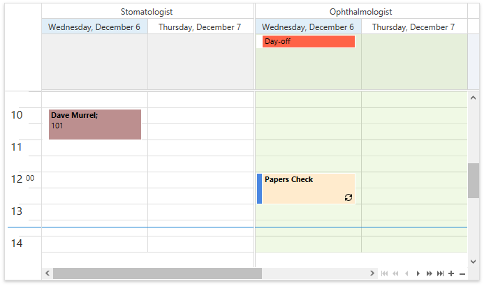

<!-- default badges list -->

<!-- default badges end -->

# WPF Scheduler - Handle the CustomAppointmentBackground Event to Change the Appointment Background

This example handles the [SchedulerControl.CustomAppointmentBackground](https://docs.devexpress.com/WPF/DevExpress.Xpf.Scheduling.SchedulerControl.CustomAppointmentBackground) event to change the appointment background color. Regular, recurrent, and all-day appointments are painted with different colors:

## Files to Review

* [MainWindow.xaml](./CS/CustomAppointmentBackground/MainWindow.xaml)
* [MainWindow.xaml.cs](./CS/CustomAppointmentBackground/MainWindow.xaml.cs) (VB: [MainWindow.xaml.vb](./VB/CustomAppointmentBackground/MainWindow.xaml.vb))

## Documentation

* [SchedulerControl.CustomAppointmentBackground](https://docs.devexpress.com/WPF/DevExpress.Xpf.Scheduling.SchedulerControl.CustomAppointmentBackground)
* [Customize Appointments](https://docs.devexpress.com/WPF/119867/controls-and-libraries/scheduler/styles-and-templates/visual-appointment)

## More Examples

* [WPF Scheduler - Customize Appointment Appearance](https://github.com/DevExpress-Examples/how-to-customize-the-appointment-appearance-t545892)
* [WPF Scheduler - Customize the Appointment Flyout and Tooltip](https://github.com/DevExpress-Examples/how-to-customize-the-appointment-flyout-t584389)
* [WPF Scheduler - Disable Resource Colorization](https://github.com/DevExpress-Examples/how-to-disable-resource-colorization)
* [WPF Scheduler - Customize Cell Colors](https://github.com/DevExpress-Examples/how-to-set-the-cell-color-using-different-approaches-t604609)
